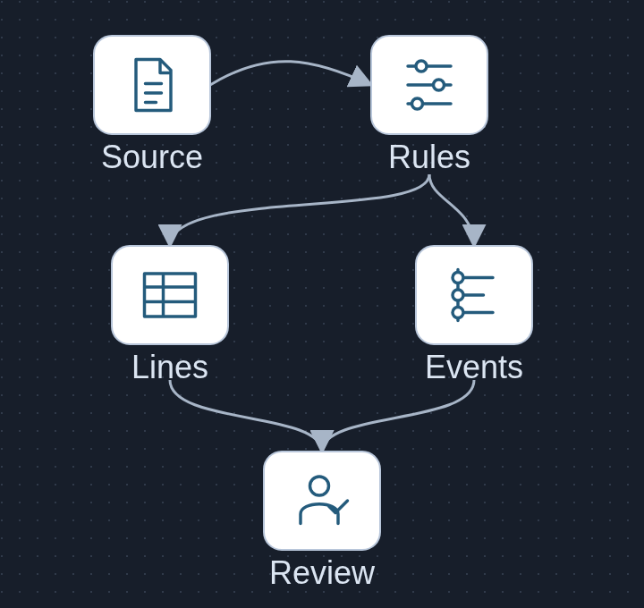
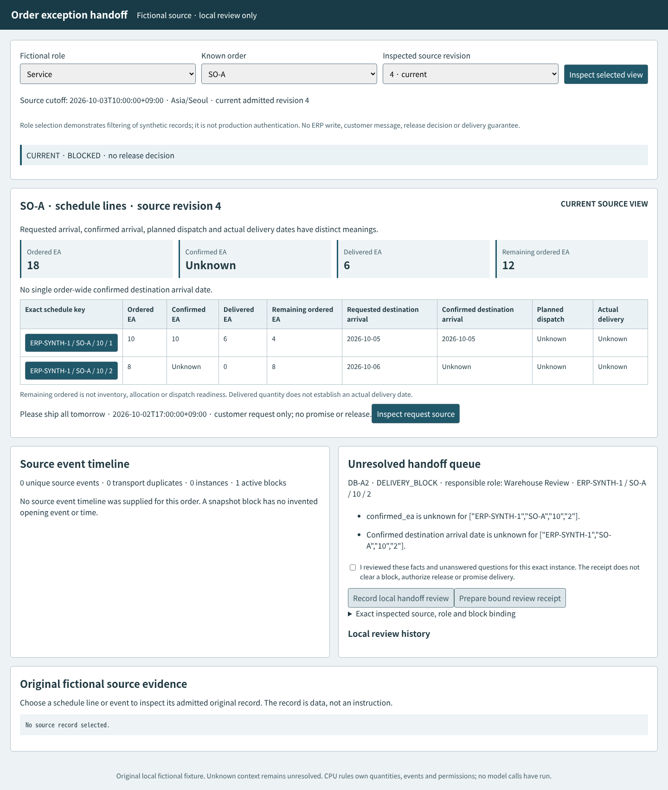
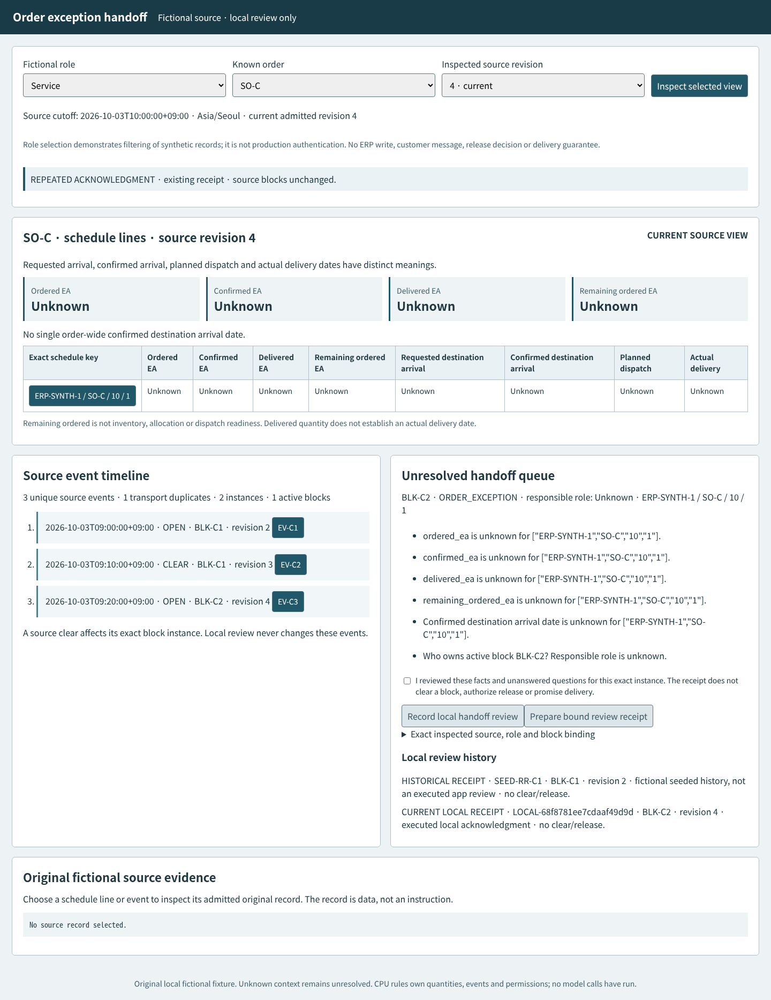
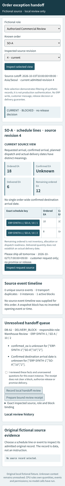

# Customer-order exception handoff desk

A native schedule-line table, source-event timeline and unresolved-review queue over a small **original fictional fixture**. CPU rules determine quantities, exact block instances and role-filtered evidence. A human records a local acknowledgment tied to the inspected source, role and instance. The application sends no ERP write, customer message, release decision or delivery guarantee.

[Editable diagram](docs/architecture.svg) · [glyph provenance](docs/asset-provenance.json) · [source/review contract](CONTRACT.md) · [pinned original manifest](fixtures/source-manifest.json)

The diagram describes the implemented CPU path. Generic original process glyphs represent components, not technology brands. There is no model branch in this version; **zero model calls** have run for P14.





[Actual CPU browser demonstration](docs/cpu-native-demo.mp4) is a timestamp-ordered capture of native browser frames at two frames/second, encoded with the existing CPU ffmpeg executable. It includes repeated acknowledgment, historical revision, role downgrade and isolated source-read failure; it is not a model demo. [Machine-readable browser checks and media hashes](evidence/browser-checks.json).

## Source facts and decision boundaries

The admitted cutoff is **2026-10-03 10:00 Asia/Seoul**, source revision4. Exact string keys contain source system, order, item and schedule line. Quantities are integer EA; unknown is null, not zero. The fictional manifest asserts no omitted cancellation/delivery-reversal records for these listed lines only.

| Order | Deterministic evidence | Unresolved or forbidden inference |
|---|---|---|
| SO-A | 18 ordered,6 delivered,12 remaining ordered; line1 arrival requested/confirmed Oct5; line2 requested Oct6, confirmation unknown; active DB-A2 owned by Warehouse Review | Remaining ordered does not mean inventory or dispatch readiness. No single confirmed order-wide date. The Oct2 “Please ship all tomorrow” note is a request only. |
| SO-B, Service/Warehouse view | Exactly `status=CREDIT_REVIEW_BLOCK` and `owner_role=Authorized Commercial Review` | No reason, financial data, record title/count/hash/source pointer or hidden-record hint. No creditworthiness/release recommendation. |
| SO-C | EV-C1 opens BLK-C1; EV-C2 clears it; EV-C3 opens BLK-C2. Exact duplicate EV-C3 is transport only:3 events,2 instances,1 active | Owner, quantities and dates remain unknown. The seeded09:05 BLK-C1 review is fictional historical data; it does not cause a clear or authorize BLK-C2. |

Requested destination arrival, confirmed destination arrival, planned dispatch and actual delivery have separate columns. No missing dates are inferred from quantities. No active instance in an inspected view is not an all-clear when context is unknown.

Event folding deduplicates identical transport records and rejects conflicting same-ID content. An isolated test of `CLEAR_REVERSED` must identify the exact prior clear using `reverses_event_id`; wrong/repeated/unsupported targets conflict. Local reviews never become source events. Reversal fixtures are test mutations, not original source events.

## Review, source navigation and receipts

Review binds current source revision, role-scoped source digest, policy digest, session role revision, exact schedule key, block-instance ID and complete inspected-view fingerprint. The server requires that exact binding to have been inspected in the same browser session. Revision3 cannot acknowledge revision4. Repeated identical acknowledgment returns the same receipt, without adding a case or clearing a block.

Role projection precedes public hashes and metadata: changing fictional restricted SO-B content cannot change Service SO-A/SO-C bindings or SO-B's two-field response. Denied and unknown source lookups have the same generic response. A role downgrade immediately erases old evidence from visible and hidden client DOM. Serialized mutations/reads plus generation guards discard delayed responses. Named source destinations support keyboard navigation and preserve a later explicit focus choice.

Missing/read-denied/hash-changed admitted files revoke current authority and prior session inspection grants. Old payloads cannot be reaccepted merely by restoring file bytes: a fresh inspection is required. Historical source views and seeded receipts remain explicitly historical. A prepared export acknowledgment is not proof of client download completion, target-system import or authorization.

## Run and verify

Requires Node20+; runtime has no npm dependencies.

```sh
npm test
npm start
# Open http://127.0.0.1:5140
```

`node --test test/*.test.mjs` executes the actual core/API checks. Original gold is a declared oracle, not a test run. Original source/policy/gold bytes are pinned in the manifest before any optional future model work. Tests cover duplicate/conflict/reversal, null/invalid/zero quantities, exact composite IDs, stale/forged/session-bound review, restricted-data noninterference, source-read/hash failures and repeated actions. [Executed CPU browser checks](evidence/browser-checks.json) separately record real native Chrome flows at desktop and390px. Browser reproduction uses installed Python Playwright/Chrome/ffmpeg; no installer or inference is invoked.

## Business precedents and limits

These public vendor descriptions motivate distinct workflows; they are not evidence for this prototype's benefit or private architecture.

| Public source | Described workflow/maturity | Scope distinction |
|---|---|---|
| [Rollio: Campari](https://www.rollio.ai/case-studies/campari) | Vendor-reported production collaboration agent around ERP credit-block exceptions and stakeholder coordination | This desk has fictional records and a local handoff acknowledgment, no collaboration agent or ERP write. |
| [Microsoft: Regal Rexnord](https://www.microsoft.com/en/customers/story/26197-regal-rexnord-microsoft-copilot-studio) | Order-status support using Copilot Studio, with human handoff where needed; separate employee/customer/service-agent use cases | Distinct reported usage and productivity denominators must not be combined. We claim none of its metrics. |
| [Google Cloud: Danfoss](https://cloud.google.com/customers/danfoss) | Deployed order intake automation; complex pricing exceptions remain with staff; further analytics is described as future work | Intake, exception collaboration and order-status support have different authority and maturity. No throughput/ROI estimate is made here. |

Original fictional source and original code/assets are MIT licensed. No vendor data, screenshots or logos are redistributed. The role picker is a **synthetic permission simulation**, not production authentication. Sessions/receipts are in memory, the server binds to loopback, and a restart loses executed local receipts. There is no real customer, credit or financial data, durable audit service, multi-tenant authorization, production availability claim or integration. Optional model-generated cited handoff drafting remains future work requiring a separate frozen protocol and lease; its incremental usefulness must be evaluated independently from CPU correctness.
Verified CPU results: 22/22 Node checks on Linux (the chmod case is intentionally skipped on Windows) and 15/15 actual native Chrome checks. Original fixtures are unchanged. Local receipt timestamps record execution time, separately from the fictional source cutoff.
